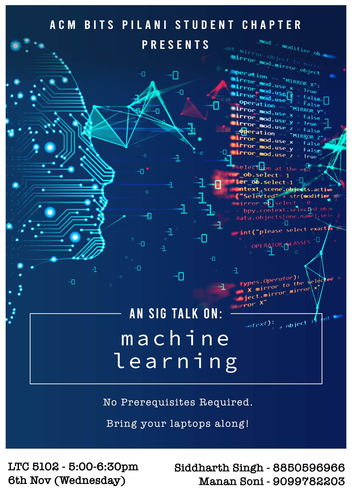

# ML-SIG  2019: lecture 1 
##### Join the [BITSACM slack group](https://forms.gle/7th7Q3YtBh4NVXFM7) now!

The first in a series of lectures on Machine Learning organized by BITS-ACM.
This was an introductory lecture that introduced people to the world of Machine
Learning.
Interactive jupyter notebook was used. (accessible from the binder link
[here](https://mybinder.org/v2/gh/coolsidd/ML_SIG_2019_Lecture/master "view
notebook in binder")) 

## Topics covered
* Introduction - definition of Machine Learning
* Introduction to linear regression
* Extending linear regression - polynomial regression.
* Introduction to Neural Networks
* Shortcomings of Neural Networks
* Visualizing clustering algorithms

## Pictures of the Event
The live lecture was conducted on November 6th 2019.

  

  

   

## Queries?
For any queries contact any of the lecturers below or alternatively, you can
join the BITS-ACM machine-learning channel on [Slack](http://bitsacm.slack.com/)
by filling this [this google form](https://forms.gle/7th7Q3YtBh4NVXFM7).

## Lecturers
* [Siddharth Singh](https://github.com/coolsidd)
* [Manan Soni](https://github.com/MananSoni42)
 
